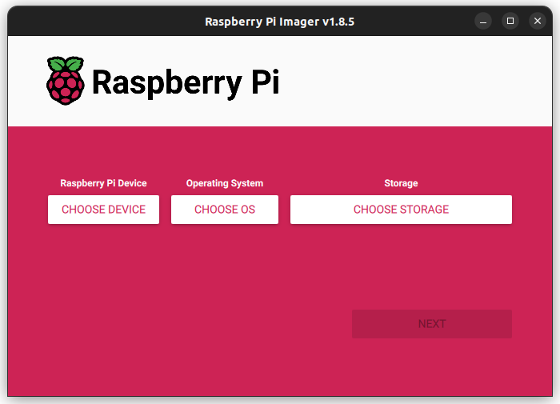
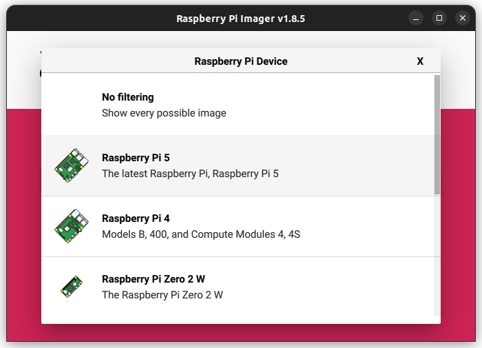
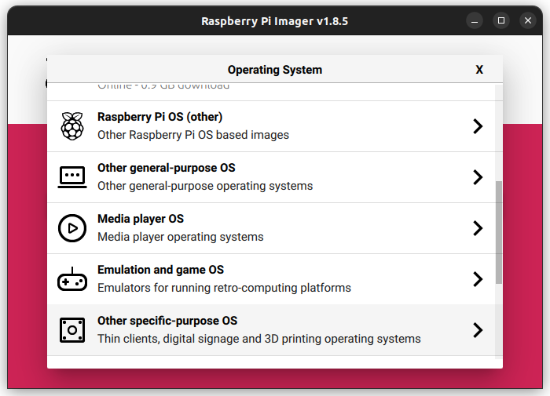
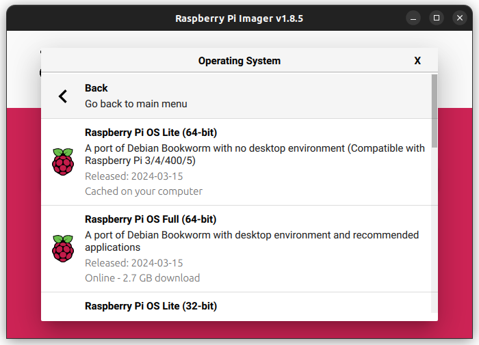
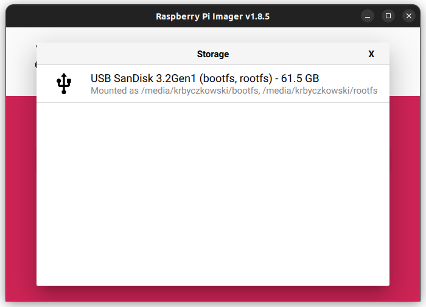
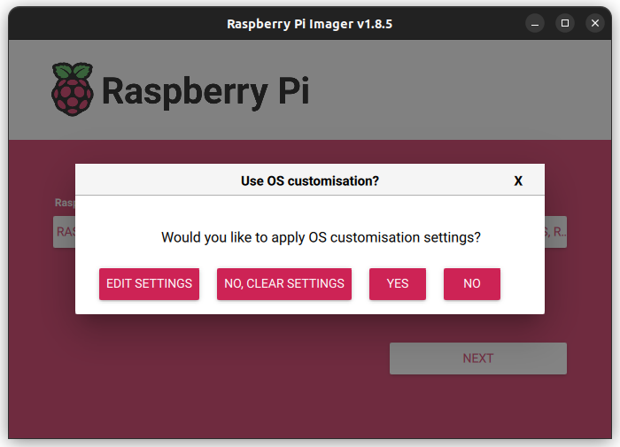
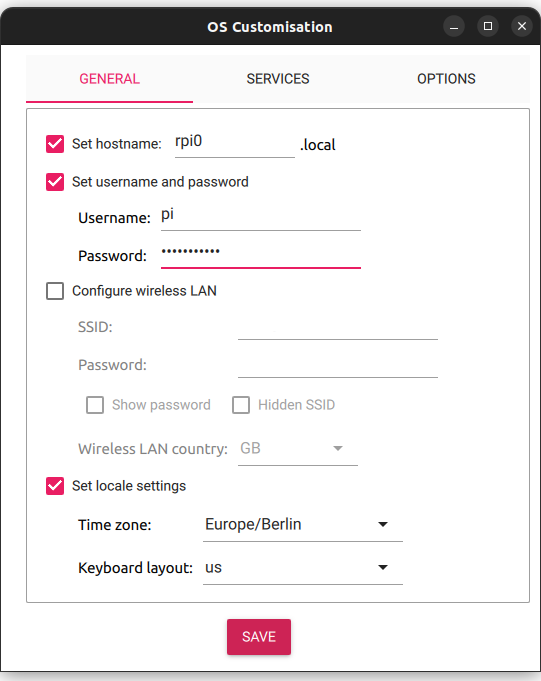
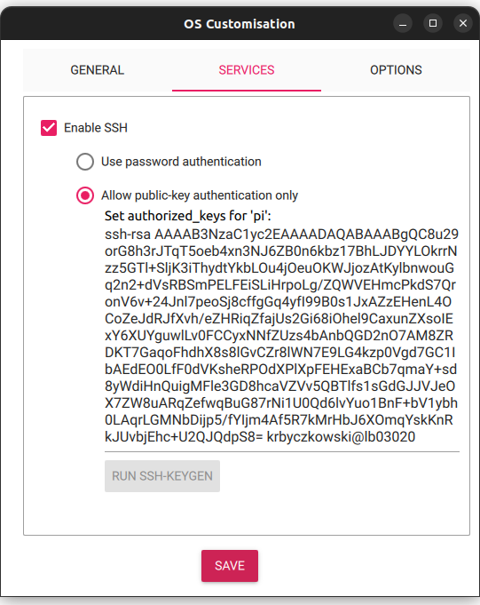
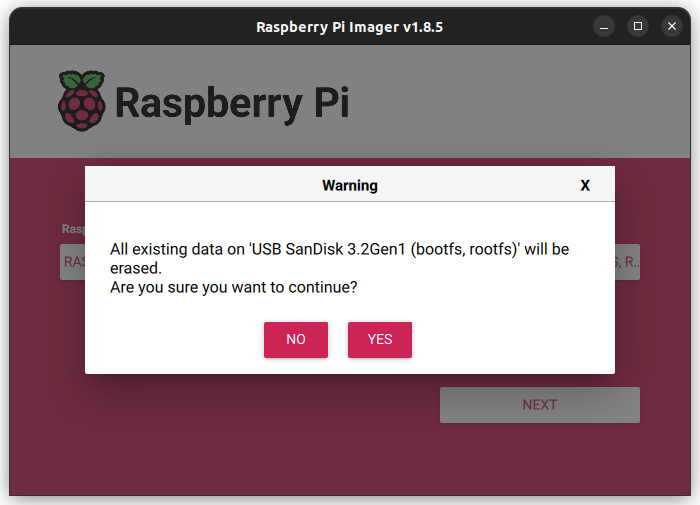

# rpi-test-env

A test environment made for Raspberry Pi's

## Master Image Build Process

This describes the build process for the master image.

### build image
The [Raspberry Pi Imager](https://github.com/raspberrypi/rpi-imager) will be needed. Plug in the USB drive or the SD card, and start Raspberry Pi Imager.



In Raspberry Pi Imager, select the Raspberry Pi 4 Series.



For the OS selection, select "Raspberry Pi OS (other)" and click "Raspberry Pi OS Lite (64-bit)".





Select the drive that the OS will be flashed on.



Proceed by clicking on Next, and edit the Settings.



Within the General tab, enter the hostname, as the master should be "rpi0". The username should be named as "pi", and enter your password.
If WiFi is needed, configure the Wi-Fi network credentials.



In the Services tab, enable SSH and make sure that `authorized_keys` is filled. If the field is not filled out, run `ssh-keygen` to create a
pair of SSH keys, allowing logging in without having to enter a password.



Apply the settings and start flashing the OS by clicking on "Yes". Grant access for the flashing process by entering the superuser password.
Shortly afterwards, the installation will start.



### configure image
For the network configuration, the IP address needs to be static. Edit the `/etc/network/interfaces` and append `auto lo`. Create a separate
file, naming it `eth0` for Ethernet connection, or `wlan0` for WiFi, placing it under `/etc/network/interfaces.d/`. The name can be different,
since the network interface can vary upon different hardware/kernel configurations. Edit the newly created file, and apply the network configuration,
following this similar scheme:

```
allow-hotplug INTF_NAME
iface INTF_NAME inet static
  address ADDR1
  netmask ADDR2
```

Replace `INTF_NAME` with the network interface name, `ADDR1` with the static IP address and `ADDR2` with the network mask.

Restart the Raspberry Pi to apply the changes. This will allow the IP address to be accessible on the local network.
